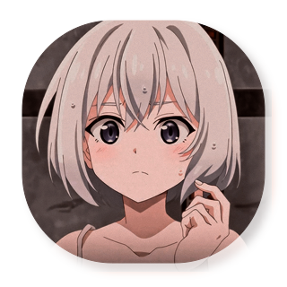

 

 
 
  
- Name: **Nguyễn Hùng Anh**

- Live in **Thanh Hoa, Vietnam**

- Studying [***Computer And Network Engineering***](https://smkn4palembang.sch.id/)

- Good with **C++**, **Python** & **JavaScript**

- My favourite games: **Valorant**, **Minecraft** & **AOV**

- Understand **English** and **Vietnamese**

 

 
 
  
- 📗 [***HungAnhDev/LapTrinhPhoThong***](https://github.com/AokoAsami199/LapTrinhPhoThong)  
  C++ exercise library for high school students.

 
 
  
 *“People with evil intent can do evil things without lying. And not all liars are evil.” – Elaina* 
<!--

-->

